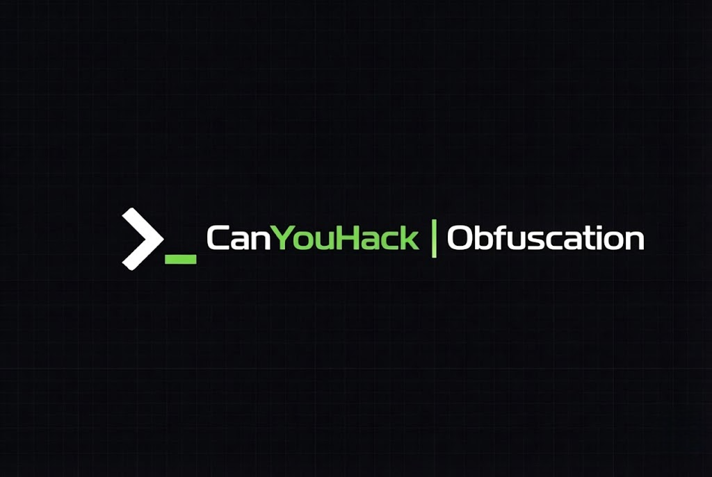

<p align="center">
  
</p>

<p align="center">
  <a href="https://github.com/canyouhack-org/cyh-obfuscator/stargazers"></a>
  <a href="https://github.com/canyouhack-org/cyh-obfuscator/blob/main/LICENSE"></a>
  <a href="https://github.com/canyouhack-org/cyh-obfuscator"></a>
</p>

# CYH Obfuscator

A universal code obfuscator supporting 20 programming languages in a single browser-based tool.

## Why Use This?

Most obfuscation tools handle only one language or require installing separate packages for each. This project gives you a unified interface for JavaScript, Python, Java, C++, and 16 other languages without installing anything.

**Your code stays private.** Everything runs in your browser. We don't upload, store, or transmit your code to any server. What you paste stays on your machine.

## Supported Languages

| Category | Languages |
|----------|-----------|
| Popular | JavaScript, Python, Java, C#, C/C++, Go |
| Scripting | PHP, Ruby, Perl, Lua, PowerShell, Bash, Groovy |
| Systems | Rust, Scala, Dart |
| Web | HTML, CSS, SQL |

## Features

**Multi-language support** — One tool handles 20 programming languages with syntax-aware obfuscation techniques tailored for each.

**String encoding** — Transforms readable strings into Unicode escapes, hex sequences, or CHAR() functions depending on the language.

**Variable renaming** — Replaces meaningful names with confusing alternatives like `_OoIl10` that are syntactically valid but hard to follow.

**Comment stripping** — Removes all comments including single-line, multi-line, and language-specific formats.

**Dead code injection** — Inserts unreachable code blocks to mislead anyone trying to reverse engineer your work.

**Minification** — Reduces file size while making structure harder to understand.

**Presets** — Choose from Quick (minimal), Strong (balanced), or Maximum (all techniques enabled).

## Privacy

This tool runs entirely in your browser using client-side JavaScript. Your code never leaves your computer. We have no backend that receives or stores submitted code.

If you're working with proprietary or sensitive code, you can verify this by checking the network tab in your browser's developer tools while using the obfuscator.

## Getting Started

```bash
git clone https://github.com/canyouhack-org/cyh-obfuscator.git
cd cyh-obfuscator
npm install
npm run dev
```

Open `http://localhost:4321` in your browser.

## How It Works

Each language follows a consistent obfuscation pipeline:

1. **Extract strings** — Store them with placeholders to protect content
2. **Remove comments** — Safe because strings are already protected
3. **Rename identifiers** — Replace variables and function names
4. **Inject dead code** — Add unreachable blocks if enabled
5. **Restore strings** — Apply encoding like Unicode or hex escapes
6. **Minify output** — Remove whitespace and compress

Language-specific handlers deal with quirks like string interpolation, raw strings, and reserved keywords.


## Limitations

- Online IDE environments may not support interactive input functions
- Heavy obfuscation increases file size
- Some techniques may affect runtime performance

## License

This project is licensed under the MIT License. You can use, modify, and distribute it freely for personal or commercial purposes. See the [LICENSE](LICENSE) file for details.

## Contributing

Found a bug? Want to add another language? Open an issue or submit a pull request on [GitHub](https://github.com/canyouhack-org/cyh-obfuscator).

---

<p align="center">
  Built by <a href="https://canyouhack.org">CanYouHack</a> — Start your cybersecurity journey with CTF challenges.
</p>
